# codeQuiz

1. I created a basic layout of the start screen and adjusted the layout with CSS

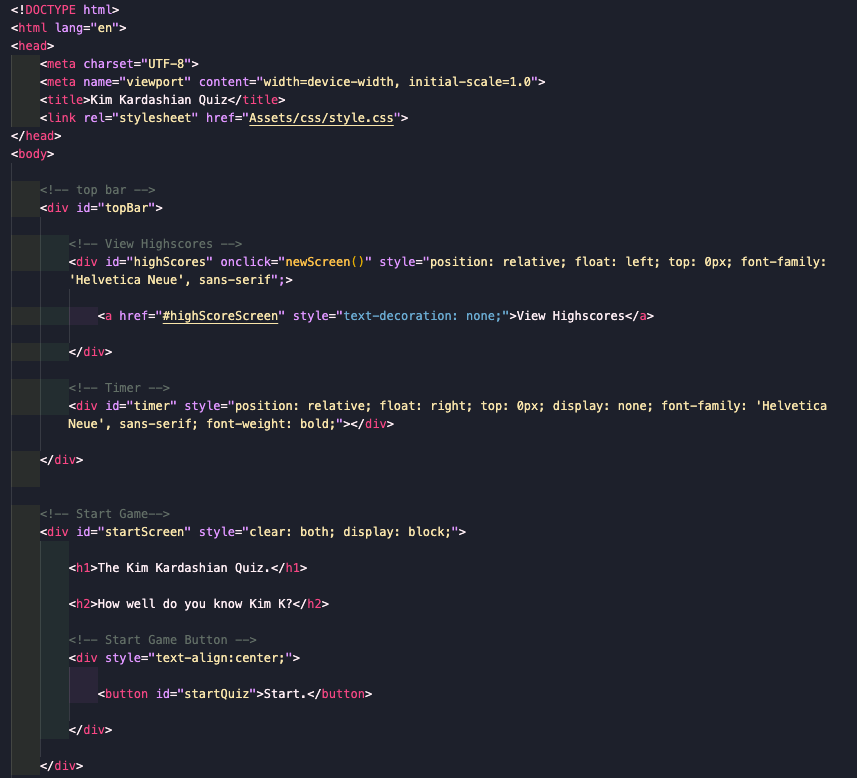

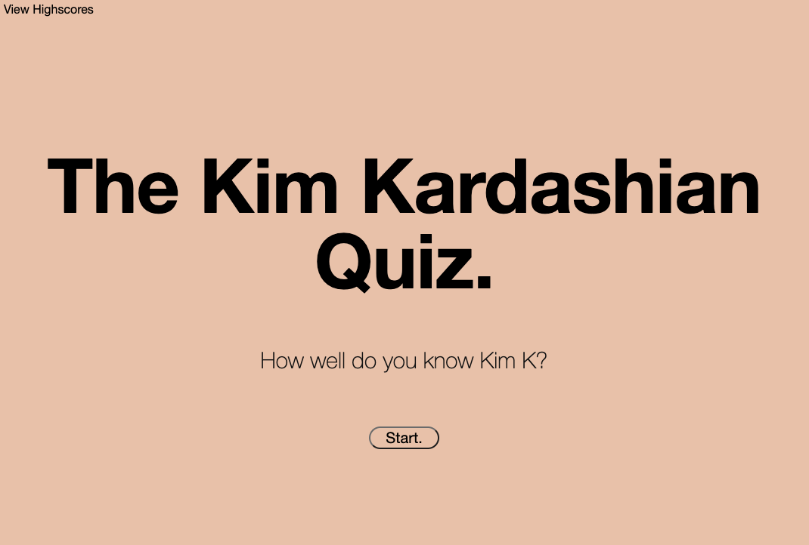

2. Created an array of questions, choices, and correct answer.

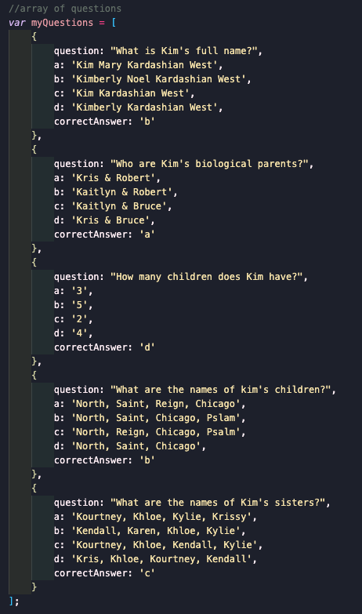

3. Listed all the variables using querySelector

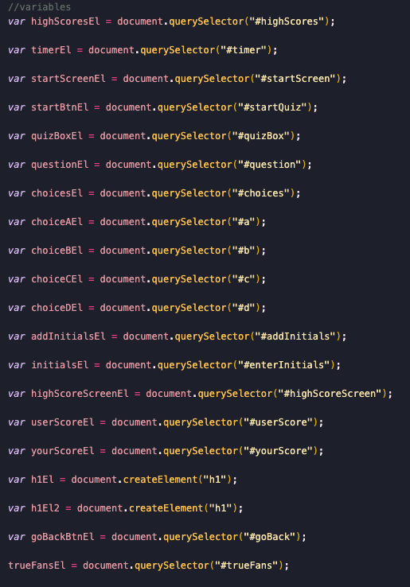

4. Created function for the Start Button on the Start Screen to start displaying questions

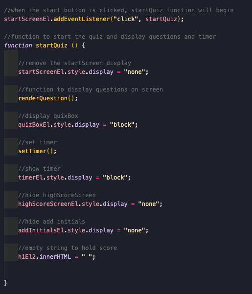

5. Created a function to display the question and created a counter to increase by one to show the next question and change score

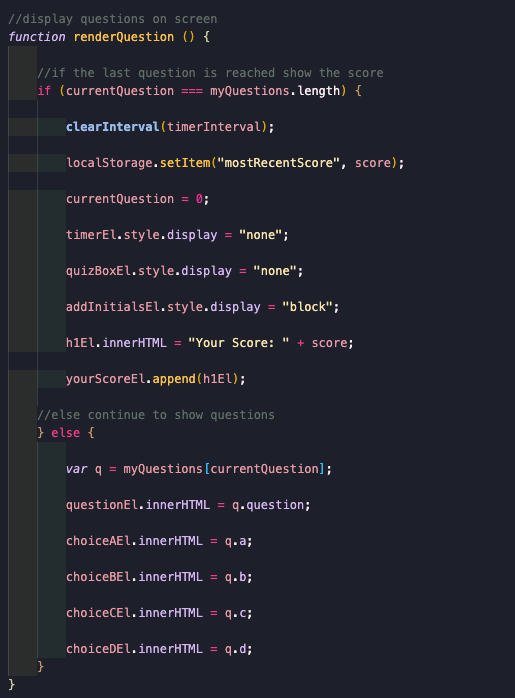

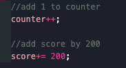

6. Created a function to check whether answer is correct or wrong

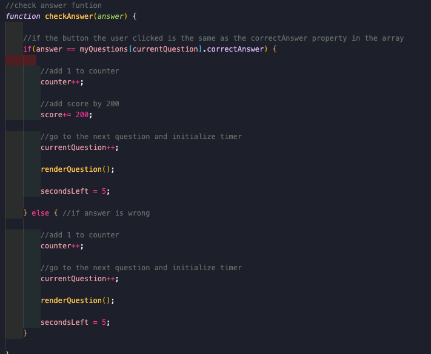

7. Created function to store scores & initials in local storage

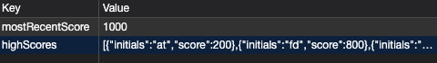

8. Created function to display scores retrieved from the local storage

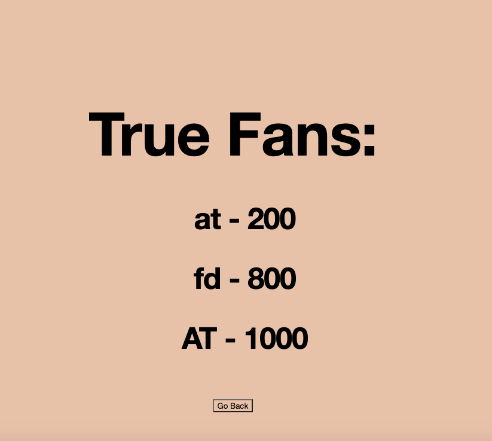

9. Made page responsive

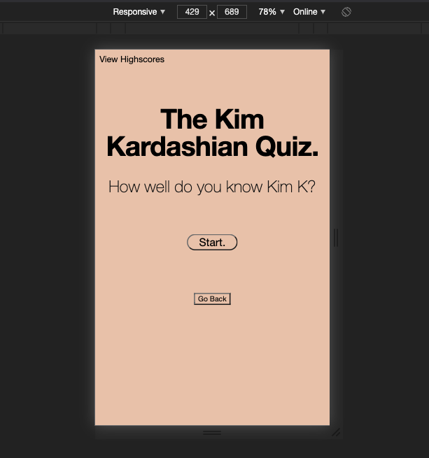

